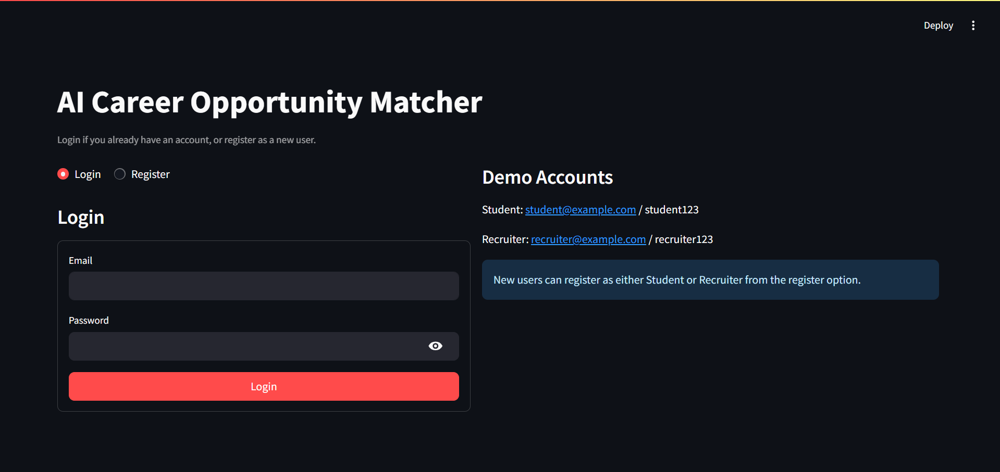
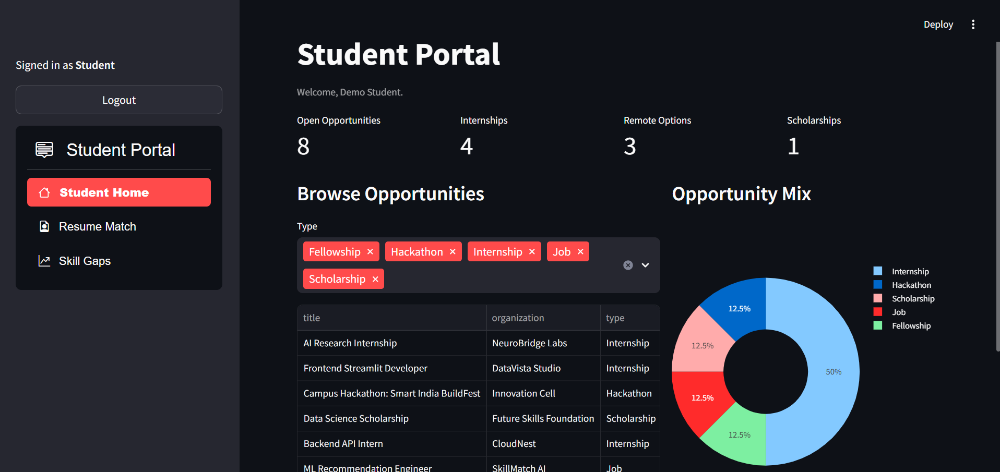
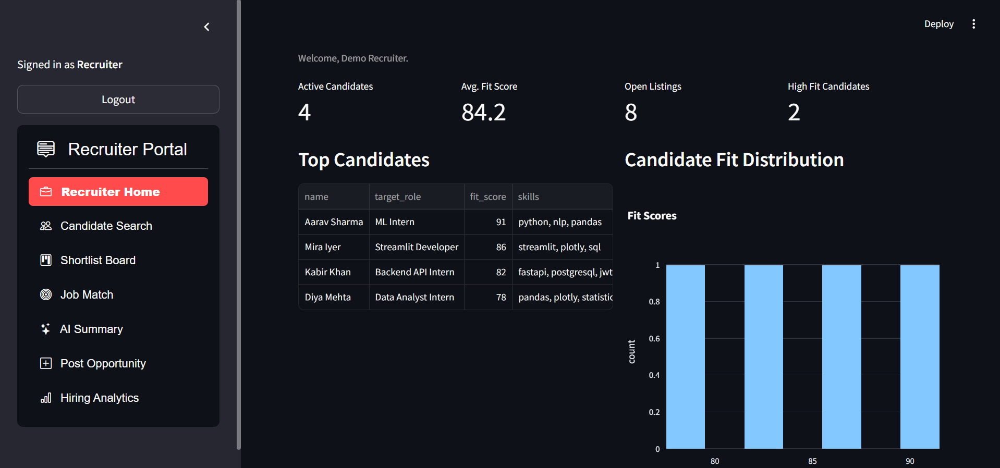

# 🚀 CareerLens AI

### AI Opportunity Recommendation & Talent Matchmaking Platform

<p align="center">
Helping students discover better opportunities while enabling smarter recruiter matchmaking through AI.
</p>

<p align="center">


</p>

---

## 🌍 Problem Statement

Students often struggle to find opportunities that genuinely match their:

* Skills
* Interests
* Eligibility
* Career goals

Most platforms focus mainly on **listings and broad discovery**, leaving students uncertain about:

* What opportunities they qualify for
* Which skills they are missing
* Which opportunities best fit their profile
* How to improve their chances

At the same time, recruiters face:

* Large applicant pools
* Manual screening
* Resume overload
* Weak candidate-job matching

**CareerLens AI** bridges both gaps through **AI-powered opportunity discovery and talent matchmaking.**

---

## 💡 What is CareerLens AI?

CareerLens AI is an **AI-powered career intelligence platform** designed for:

### 🎓 Students

* Discover opportunities
* Analyze resume strength
* Identify skill gaps
* Improve career readiness

### 🏢 Recruiters

* Discover relevant candidates
* Reduce screening effort
* Improve hiring quality
* Match talent intelligently

Instead of functioning as just another job board, CareerLens AI acts as an:

> AI-powered career intelligence and matchmaking ecosystem.

---

## ✨ Core Features

### 📄 AI Resume Intelligence

Upload:

* PDF
* DOCX
* TXT

AI extracts:

* Skills
* Education
* Projects
* Experience
* Profile summary

---

### 🎯 Opportunity Recommendation Engine

Recommend:

* Internships
* Jobs
* Hackathons
* Scholarships
* Open-source programs
* Fellowships

Powered by:

* NLP embeddings
* Semantic similarity
* Hybrid recommendation logic

---

### 🧠 Skill Gap Detection

CareerLens AI identifies:

> Skills preventing stronger opportunity matches

Example:

```text
Current Match: 72%
Learn Docker + FastAPI → Match could improve to 88%
```

---

### 🤝 Recruiter Matchmaking

Recruiters can:

* Discover talent faster
* Reduce screening effort
* Filter candidates intelligently
* View AI-generated fit scores

Filters include:

* Graduation year
* Skill stack
* Internship duration
* Availability
* College tier
* Domain

---

## 📸 Application Preview

### 🔐 Login & Authentication

<p align="center">

</p>

---

### 🎓 Student Portal

<p align="center">

</p>

Features:

* Opportunity browsing
* Resume matching
* Skill gap analysis
* Personalized recommendations

---

### 🏢 Recruiter Dashboard

<p align="center">

</p>

Features:

* Candidate search
* Match scoring
* Hiring analytics
* Opportunity posting

---

## 🛠️ Tech Stack

### Frontend

* Streamlit
* Plotly

### Backend

* FastAPI
* Python

### AI / NLP

* Gemini API
* Sentence Transformers
* spaCy
* Scikit-learn

### Recommendation Engine

* FAISS
* Cosine Similarity
* TF-IDF fallback

### Resume Parsing

* PyMuPDF
* python-docx
* pdfplumber

### Database

* PostgreSQL / MongoDB

---

## 🏗️ System Architecture

```text
Resume Upload
        ↓
Resume Parsing
        ↓
Skill Extraction
        ↓
Embedding Generation
        ↓
Opportunity Database
        ↓
AI Matching Engine
        ↓
Fit Score + Recommendations
        ↓
Recruiter Screening + Analytics
```

---

## 📂 Project Structure

```text
backend/
│
├── main.py
├── recommender.py
├── resume_parser.py
│
data/
├── opportunities.csv
│
assets/
├── login-page.png
├── student-portal.png
└── recruiter-dashboard.png
│
streamlit_app.py
requirements.txt
README.md
```

---

## ⚙️ Installation

### 1. Clone Repository

```bash
git clone <repo-url>
cd CareerLens-AI
```

### 2. Create Virtual Environment

#### Windows

```bash
python -m venv .venv
.\.venv\Scripts\activate
```

#### Linux / Mac

```bash
python3 -m venv .venv
source .venv/bin/activate
```

### 3. Install Dependencies

```bash
pip install -r requirements.txt
```

---

## ▶️ Running CareerLens AI

### Backend

```bash
uvicorn backend.main:app --reload --port 8000
```

### Frontend

```bash
streamlit run streamlit_app.py
```

Supports **demo mode** when backend is unavailable.

---

## 🔑 Gemini Setup (Optional)

Create:

```text
.env
```

Add:

```text
GEMINI_API_KEY=your_api_key
```

Used for:

* AI summaries
* Career guidance
* Personalized recommendations

---

## 🧪 Demo Accounts

### Student

```text
student@example.com
student123
```

### Recruiter

```text
recruiter@example.com
recruiter123
```

---

## 📈 Future Roadmap

* Live opportunity scraping
* LinkedIn/GitHub integration
* Resume builder
* AI interview preparation
* Automated screening workflows
* Multi-agent recommendation system
* Career roadmap generation

---

## 🎯 Vision

CareerLens AI aims to become:

> A career intelligence and AI-powered talent matchmaking ecosystem for students and recruiters.

---

## 👨‍💻 Author

### Arya Lolusare

AI • LLM • Recommendation Systems • Full-Stack Development

GitHub:
https://github.com/AryaLolusare2712
